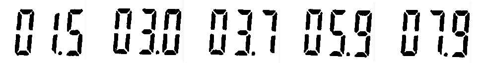

# 7-Segment Display Morphology

An image capture system is required to recognize characters from a segment display for an industrial application. The display shows characters, and pre-processing using thresholding has been applied to the image to enhance information capture.



The pattern recognition software struggles to recognize the digits due to the separation between the segments of the display. To address this issue, a program was developed to solve the problem of pre-filtering for character recognition using morphological operations. Care was taken to keep the decimal point separate from the other digits to avoid incorrect number recognition on the display.


By using another identification program, such as [Tesseract](https://github.com/ropensci/tesseract), it is possible to observe that the digits in the image are actually:

```
01.5 03.0 03.7 05.9 07.9
```