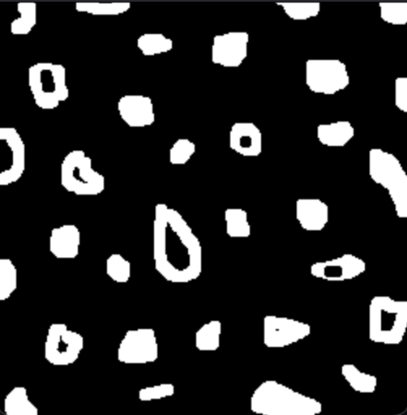
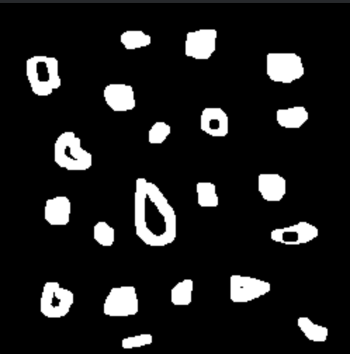
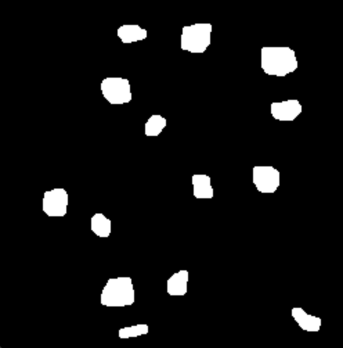

# Bubble Counter 🔍

Computer vision algorithm developed to analyze images and count the number of "bubbles" present in them, also identifying those that have holes. The algorithm is capable of determining the total number of holes in the image, even in cases where a single bubble contains multiple holes, ensuring an accurate count. The process uses image conversion to grayscale using the OpenCV library. The main method used to fill the regions is floodFill, available in the OpenCV library itself.

## Run 🚀

```bash
make main && ./main
```

<small>

  > _To use an image other than "`bubble.png`", change `line 5` corresponding to the `IMAGE_FILE` macro._

</small>

## Output 🖼️

### Images Output 📸

| Original | Edge Removed |
|-|-|
|||

| Holes Counted | Complete Count |
|-|-|
|||

### Terminal Output 🖥️

```bash
┌──────────────────────────────────────────────┐
│          Bubble Counter - bubble.png
│──────────────────────────────────────────────┤
│✅ Bubbles with holes: 7
│✅ Bubbles without holes: 14
│✅ Total of bubbles: 21
│✅ Holes: 7
│ ─ ─ ─ ─ ─ ─ ─ ─ ─ ─ ─ ─ ─ ─ ─ ─ ─ ─ ─ ─ ─ ─ ─┤
│🎓 Sudent: Ernane Ferreira - DCA0445
└──────────────────────────────────────────────┘
```

---

<div align="center">
  📚 DCA0445 - DIGITAL IMAGE PROCESSING (2024.1) 🎓 <br/>
  Federal University of Rio Grande do Norte - Department of Computer and Automation Engineering (DCA). 🏛️
</div>