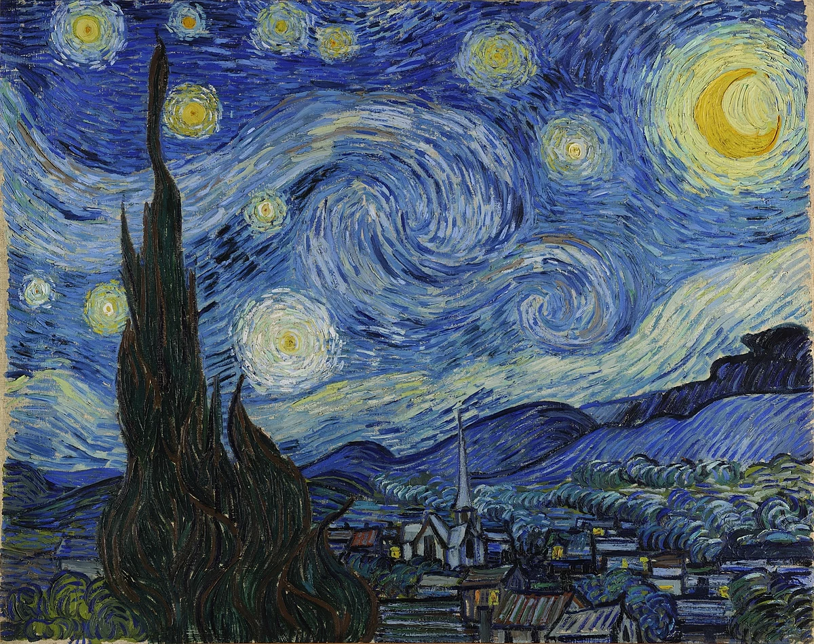
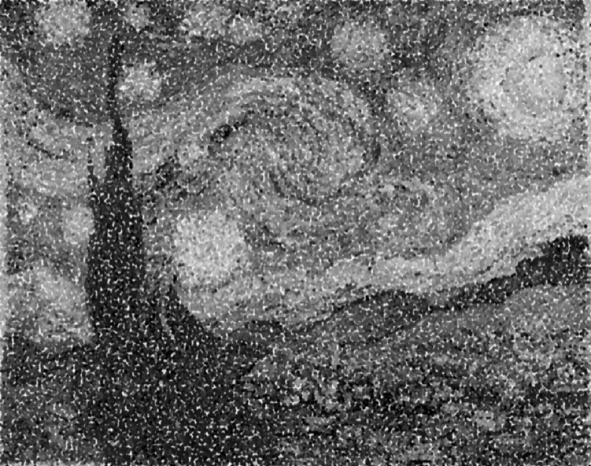
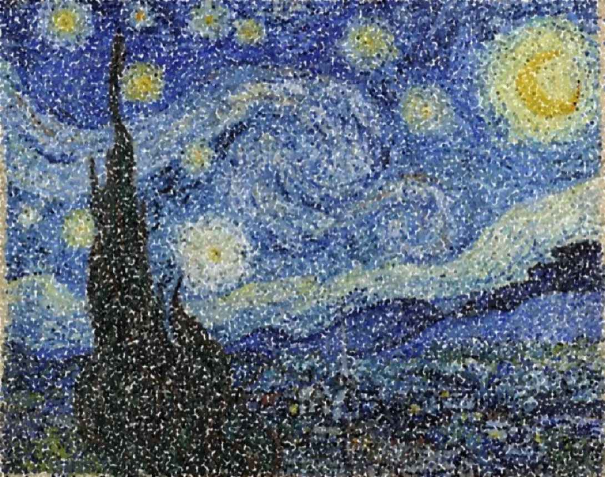
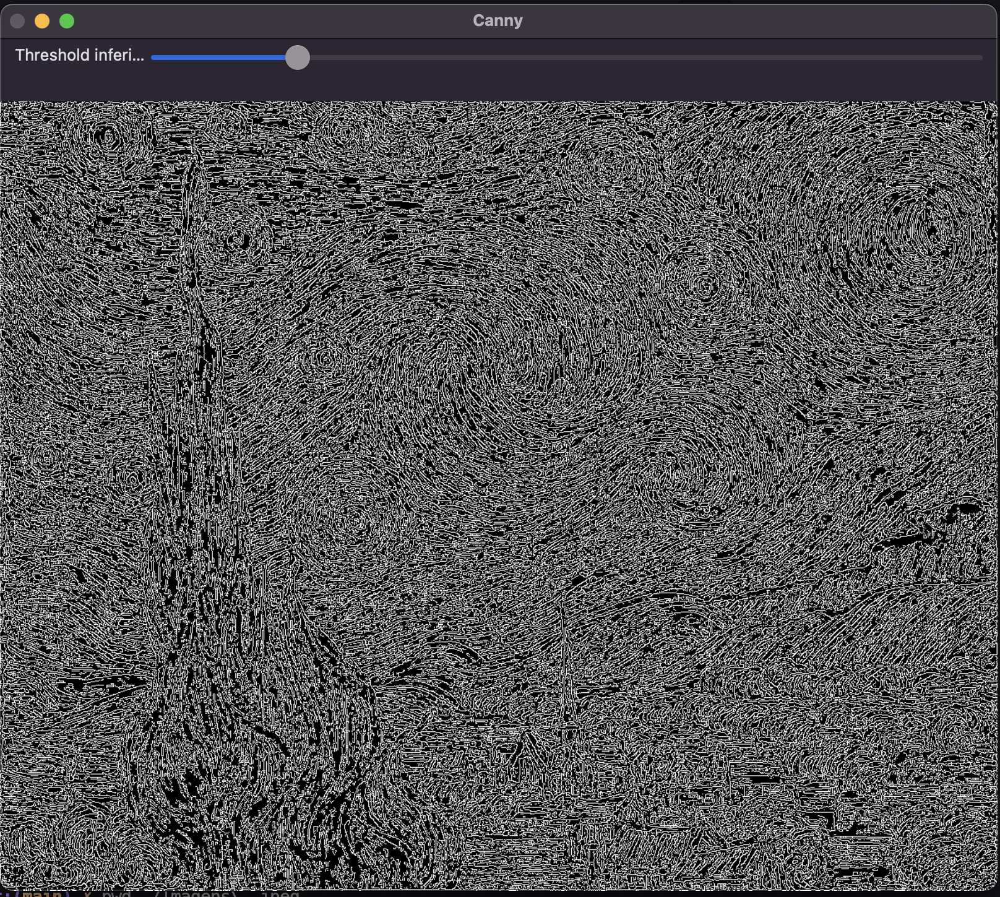
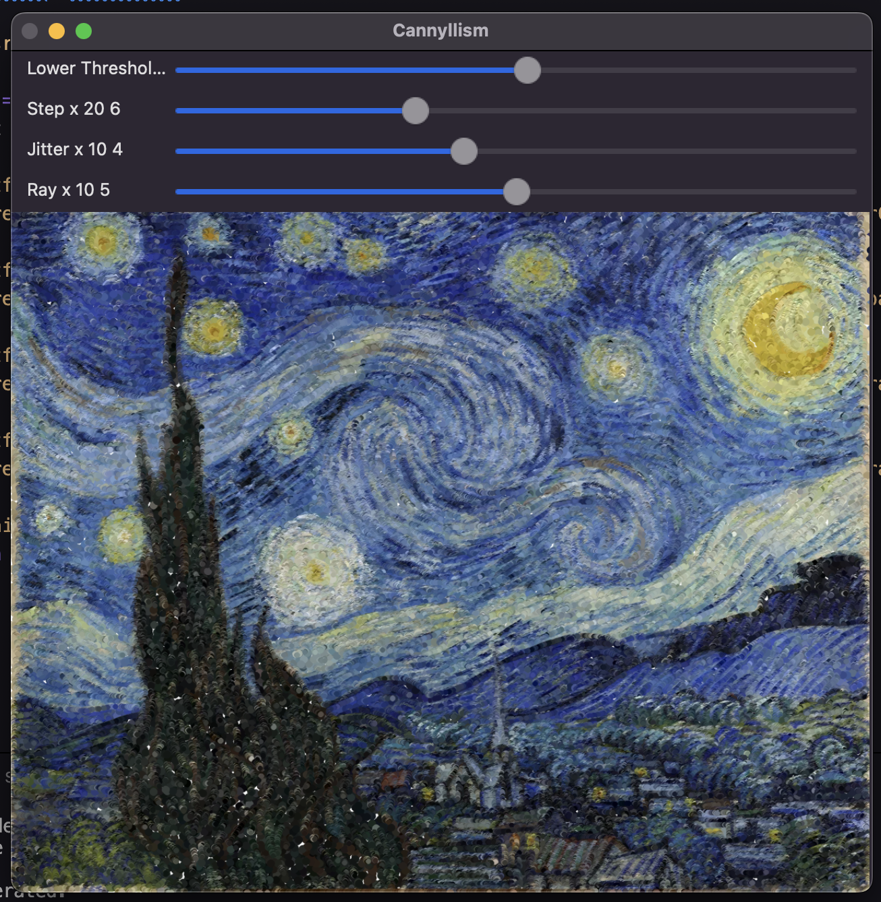
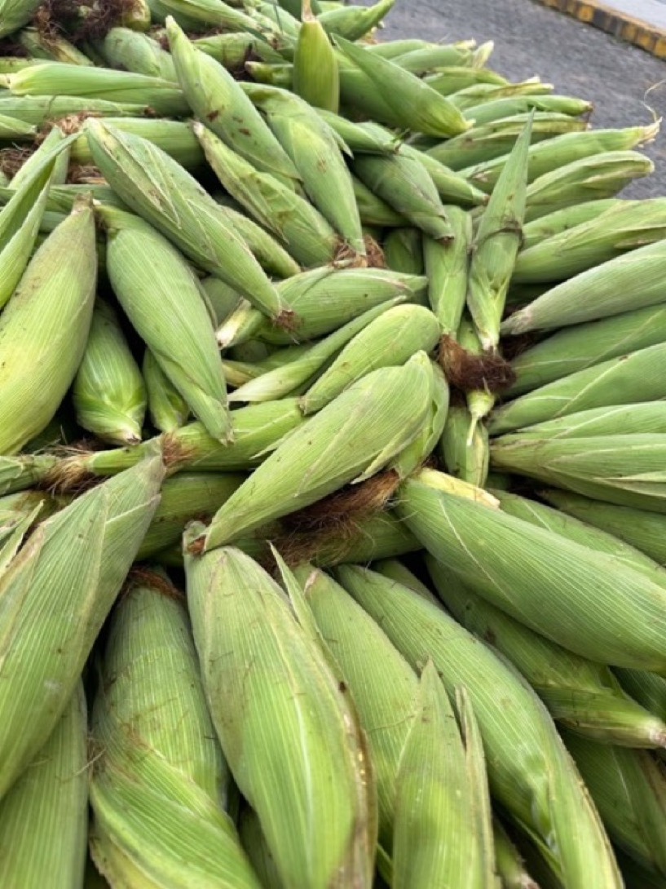
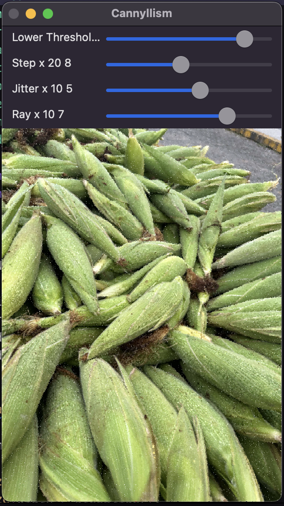

# Canny's algorithm and the art of pointillism

| The Starry Night | The Starry Night Pointillism Grayscale |
|:-:|:-:|
|||

| The Starry Night | The Starry Night Pointillism Colored |
|:-:|:-:|
|||

| The Starry Night | The Starry Night Edge Detection |
|:-:|:-:|
|||

| The Starry Night | The Starry Night Cannyllism Colored |
|:-:|:-:|
|||

| Corn | Corn Cannyllism Colored |
|:-:|:-:|
|||