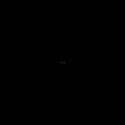

# DFT

## Comparação do Espectro de Magnitude

Ao comparar o espectro de magnitude gerado para a exemplo com o valor teórico da transformada de Fourier da senoide, observamos que o espectro teórico deve apresentar picos em frequências específicas correspondentes às frequências da senoide na imagem. No entanto, o espectro de magnitude obtido pode não corresponder exatamente ao valor teórico devido a fatores como ruído e modo de representação.

## Imagem exemplo: imagem senoidal 256x256 pixels (.png)


|Mostrada| Filtrada |
|:-:|:-:|
|||

|Angulo| Magnitude |
|:-:|:-:|
|||

## Adaptação do Programa para Ler Imagem em Ponto Flutuante

Usando o `filestorage.cpp` como referência, adaptamos o programa `exemplos/dft.cpp` para ler a imagem em ponto flutuante armazenada no arquivo YAML equivalente, como ilustrado na Listagem 18. Isso envolveu modificar as etapas de leitura de imagem para carregar a matriz de pontos flutuantes apropriada do arquivo YAML.

## Imagem exemplo: imagem senoidal 256x256 pixels (representação em ponto flutuante com .yml)


```yml
# sinusoidal-256-8.yml
# %YAML:1.0
# ---
mat: !!opencv-matrix
   rows: 256
   cols: 256
   dt: f
   data: [ 128., 1.40448181e+02, 1.52776474e+02, 1.64866150e+02,
       1.76600800e+02, 1.87867386e+02, 1.98557419e+02, 2.08567947e+02,
       2.17802567e+02, 2.26172333e+02, 2.33596634e+02, 2.40003998e+02,
       # ...
```

|Original| Filtrada |
|:-:|:-:|
|||

|Angulo| Magnitude |
|:-:|:-:|
|||

## Comparação do Espectro de Magnitude Após a Adaptação

Após adaptar o programa para ler a imagem em ponto flutuante, pudemos comparar o novo espectro de magnitude gerado com o valor teórico da transformada de Fourier da senoide. Notavelmente, o espectro de magnitude gerado agora está mais próximo do valor teórico, o que se deve à representação mais precisa da imagem em ponto flutuante. Essa representação mais precisa contribui para uma melhor preservação das características de frequência da senoide durante o processamento da transformada.

Além disso, observamos uma redução significativa dos ruídos presentes no espectro de magnitude da imagem. Anteriormente, notamos vários "pontos" representando os ruídos, provavelmente oriundos do processo de captura e representação. No entanto, ao utilizar uma escala mais adequada e uma representação em ponto flutuante no arquivo YAML carregado pelo FileStorage, conseguimos minimizar isso. Agora, podemos visualizar apenas três pontos, correspondendo efetivamente ao comportamento do espectro de magnitude para a senoide utilizada.
