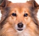
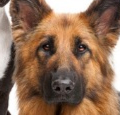

# Hu moments for regions

```cpp
// original example: hu-moments.cpp
```

| Image | Φ1 | Φ2 | Φ3 | Φ4 | Φ5 | Φ6 |  Φ7 |
|:-----:|:--:|:--:|:--:|:--:|:--:|:--:|:--:|
|  |2.88076| 8.29327| 11.5038| 10.2548| -21.1346| 14.4366| -22.4931| 
|  |2.88076|8.29327|11.5038|10.2548|-21.1346|14.4366|-22.4931|
|  |2.88167|8.30002|11.5139|10.2593|-21.1469|14.4441|-22.3274|
|  |2.88074|8.29453|11.5007|10.2553|-21.1336|14.4374|22.559|
|  |2.88071|8.29099|11.4978|10.2559|-21.133|14.4354|-22.5706|
|  |2.88074|8.29453|11.5007|10.2553|-21.1336|14.4374|-22.559|

> [❓] Using the program Momentos-Regioes.cpp as a reference, use the images `person.jpg` and `crowd.jpg` and find out in what position the person in the first image is in the second image. If the program becomes slow, check if it is possible to use the `cv::resize()` function to resize the images and make processing faster. Discuss the difficulties encountered in solving the problem.

| Person | Crowd |
|:------:|:-----:|
|||

To locate the position of the person in the first image (person.jpg) within the second image (crowd.jpg) using Hu moments, we need to follow a specific procedure. First, we calculate the Hu Moments for the person's image. The provided code already performs this step when calculating the Hu moments for an input image. It is recommended to resize images to optimize processing. We will use the cv::resize() function for this, which will be especially useful if the base image (crowd.jpg) is very large.

We then search for the subimage in the larger image through a sliding window approach to calculate the Hu moments of different regions of the crowd image and compare them with the Hu moments of the person image. We will calculate the difference between the Hu moments for each position of the sliding window. The position with the smallest difference will be considered the most likely position where the person is located.

Additionally, the original image will be displayed in RGB color scale as provided, even if the Hu moments calculation is performed in gray scale. In this image, the contour of the most likely position of the target image in the base image will be highlighted, that is, the person in the crowd.

### First Run

```cpp
make && ./main ../assets/crowd.jpg ../assets/person.jpg  

//🔍 Searching for target 1 in the base image
// Target 1 best match found at: [2129, 495]
// Difference: 0.026433
// Target 1 Hu Moments: 2.94394 8.12344 11.3141 12.2403 -24.0208 -16.3033 24.9321 
```

| Φ1 | Φ2 | Φ3 | Φ4 | Φ5 | Φ6 |  Φ7 |
|:--:|:--:|:--:|:--:|:--:|:--:|:--:|
|2.94394|8.12344|11.3141|12.2403|-24.0208|-16.3033|24.9321|

| Output - Person in the crowd |
|:----------------------------:|
||

### Second Run


| Image | Difference | Position | Φ1 | Φ2 | Φ3 | Φ4 | Φ5 | Φ6 |  Φ7 |
|:-----:|:--:|:--:|:--:|:--:|:--:|:--:|:--:|:--:|:--:|
| | 0.287254 | [0, 117]   | 2.82091 | 7.64696 | 9.66036 | 11.2305 | 21.907   | -15.1076 | 21.7679  |
| | 1.21118  | [119, 186] | 2.9617  | 9.76345 | 10.9045 | 12.185  | -23.7314 | -17.1343 | -24.8001 |
| | 0.152389 | [218, 162] | 2.75251 | 7.32407 | 10.0808 | 9.97411 | -20.1643 | -13.6701 | 20.1405  |
| | 0.111138 | [291, 220] | 2.73697 | 6.8654  | 10.3771 | 10.0919 | -20.5491 | -13.5631 | 20.4228  |
| | 0.195709 | [398, 201] | 2.79465 | 7.24209 | 10.1481 | 10.0606 | -20.5355 | -13.8491 | 20.2085  |
| | 0.210532 | [458, 121] | 2.88016 | 7.39853 | 11.1223 | 11.0113 | -22.2928 | 14.8293  | 22.1791  |
| | 0.822271 | [525, 192] | 2.83037 | 7.60393 | 10.2781 | 10.3778 | -21.3484 | -14.1908 | 20.7173  |
| | 0.822271 | [315, 80]  | 2.80088 | 7.63917 | 11.67   | 11.4789 | -23.4633 | 15.651   | -23.089  |

| Output - Dogs |
|:----------------------------:|
||

```cpp
make && ./main ../assets/dogs.png ../assets/dog-*.jpg


// 🔍 Searching for target 1 in the base image
// Target 1 best match found at: [0, 117]
// Difference: 0.287254
// Target 1 Hu Moments: 2.82091 7.64696 9.66036 11.2305 21.907 -15.1076 21.7679 

// 🔍 Searching for target 2 in the base image
// Target 2 best match found at: [119, 186]
// Difference: 1.21118
// Target 2 Hu Moments: 2.9617 9.76345 10.9045 12.185 -23.7314 -17.1343 -24.8001 

// 🔍 Searching for target 3 in the base image
// Target 3 best match found at: [218, 162]
// Difference: 0.152389
// Target 3 Hu Moments: 2.75251 7.32407 10.0808 9.97411 -20.1643 -13.6701 20.1405 

// 🔍 Searching for target 4 in the base image
// Target 4 best match found at: [291, 220]
// Difference: 0.111138
// Target 4 Hu Moments: 2.73697 6.8654 10.3771 10.0919 -20.5491 -13.5631 20.4228 

// 🔍 Searching for target 5 in the base image
// Target 5 best match found at: [398, 201]
// Difference: 0.195709
// Target 5 Hu Moments: 2.79465 7.24209 10.1481 10.0606 -20.5355 -13.8491 20.2085 

// 🔍 Searching for target 6 in the base image
// Target 6 best match found at: [458, 121]
// Difference: 0.210532
// Target 6 Hu Moments: 2.88016 7.39853 11.1223 11.0113 -22.2928 14.8293 22.1791 

// 🔍 Searching for target 7 in the base image
// Target 7 best match found at: [525, 192]
// Difference: 0.222234
// Target 7 Hu Moments: 2.83037 7.60393 10.2781 10.3778 -21.3484 -14.1908 20.7173 

// 🔍 Searching for target 8 in the base image
// Target 8 best match found at: [315, 80]
// Difference: 0.822271
// Target 8 Hu Moments: 2.80088 7.63917 11.67 11.4789 -23.4633 15.651 -23.089 
```
