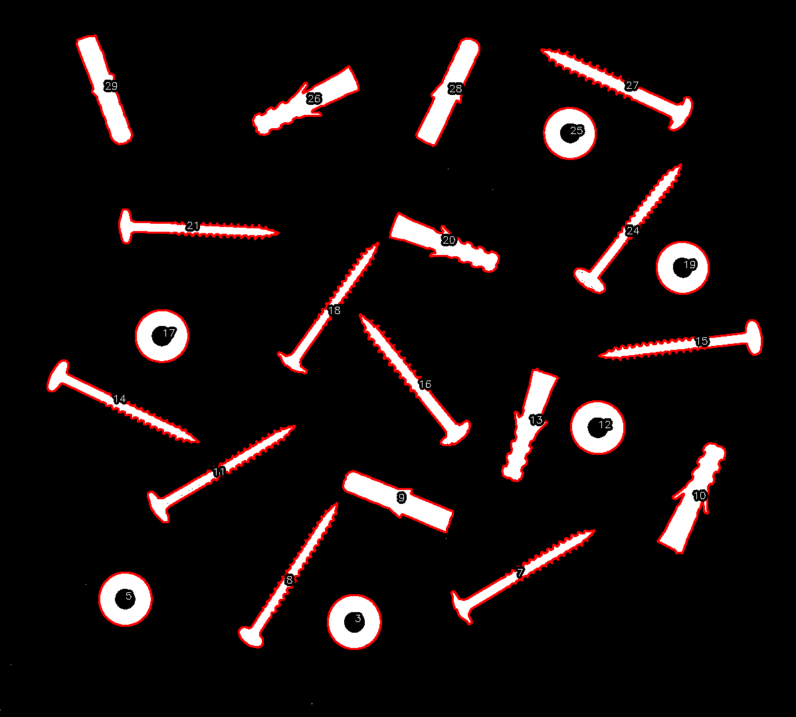

# Hu Moments for Contours

Extraction and visualization of Hu moments for contours detected in images. Hu moments are invariant descriptors used to characterize the shape of objects in digital images.

| Original image | Labeled contours |
|:-------------:|:----------------:|
|  |  |

The image on the left shows the original image from which the contours are extracted. The image on the right displays the original contours with labels and colors based on the Hu moment criteria.

The Hu moments extracted from each contour are stored in [moments.txt](./assets/moments.txt). Each line of the file corresponds to a contour, listing its index followed by the calculated Hu moments.

Hu moments (hu[0] to hu[6]) provide information about the geometric properties of each contour:

- **hu[0]**: Represents the overall compression of the shape.
- **hu[1]** and **hu[2]**: captures the contour orientation.
- **hu[3]** to **hu[6]**: reflects higher-order shape features such as asymmetry and curvature.

By comparing the labeled contours with their respective Hu moments, it is possible to observe how these moments describe and quantitatively differentiate the shapes present in the image.
