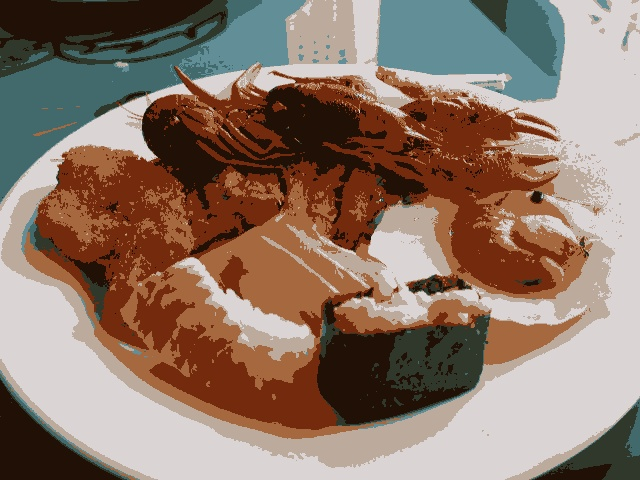
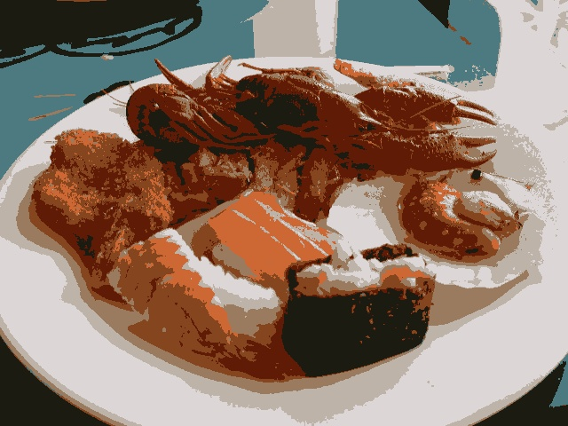

# Vector quantization with k-means

|Sushi (original)|Sushi K-means (NUM_ITERATIONS=1 and using cv::KMEANS_PP_CENTERS|
|:-:|:-:|
|||

> [❓] Using the kmeans.cpp program as an example, prepare an example program where the code is executed using the parameter nRodadas=1 and the centers are started randomly using the parameter KMEANS_RANDOM_CENTERS instead of KMEANS_PP_CENTERS. Perform 10 different rounds of the algorithm and compare the images produced. Explain why they can differ so much.

|1|2|3|4|5|
|:-:|:-:|:-:|:-:|:-:|
||||||

|6|7|8|9|10|
|:-:|:-:|:-:|:-:|:-:|
||||||

They may even look the same at a quick glance, but if you overlap each other during the execution of the algorithm, the changes will be noticeable. This may happen due to random initialization of cluster centers. In *K-means*, the initial position of the centers can influence the final result. With `NUM_ITERATIONS=1`, the algorithm does not have enough time to converge to an optimal solution, resulting in solutions that strongly depend on the initial positions of the centers. This can cause high variability in results between different runs of the algorithm.
