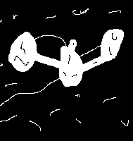
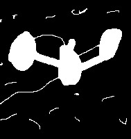
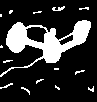
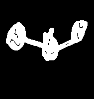

# Morphology

### Example

|Oringinal Image| Closing Operation | Dilatation Operation | 
|:-:|:-:|:-:|
||  |  |

| Erosion Operation | Open-close Operation | Opening Operation (result) | 
|:-:|:-:|:-:|
|  |  |  | 

