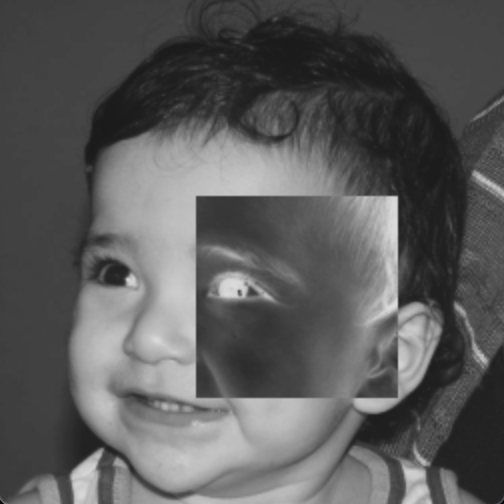

# Negative Region Inverter 🔄

A simple computer vision algorithm developed to invert the pixel values within a specified region of a grayscale image. This program allows users to select a region by specifying two points (P1 and P2) and then inverts the pixel values within that region.

## Run 🚀

```bash
make main && ./main
```

<small>

  _To use an image other than "`biel.png`", change line 4 corresponding to the IMAGE_FILE macro._
  
</small>

## Output 🖼️

### Images Output 📸

| Original | Negative |
|-|-|
|||

### Terminal Output 🖥️

```bash
🔄 Negative Region Inverter - [biel.png] 🔄

──────────────────────────────────────────────

🚨 Enter the coordinates for two points (P1 and P2).

📍 Enter the P1x: 100
📍 Enter the P1y: 100

✅ P1x and P1y are valid.

📍 Enter the P2x: 200
📍 Enter the P2y: 200

✅ P2x and P2y are valid.
✅ P1 and P2 are valid.

🚨 The region to be inverted is from P1(200, 200) to P2(250, 250).

✅ Region inverted successfully!

──────────────────────────────────────────────

🎓 Sudent: Ernane Ferreira - DCA0445
```
