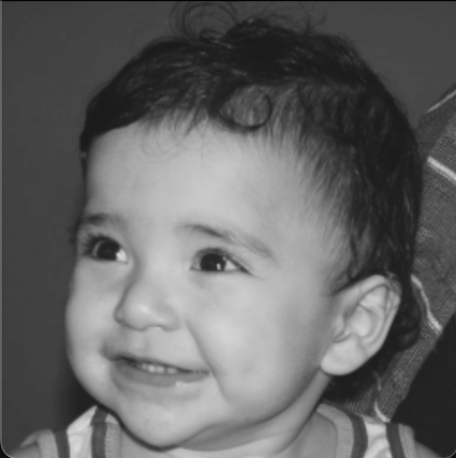
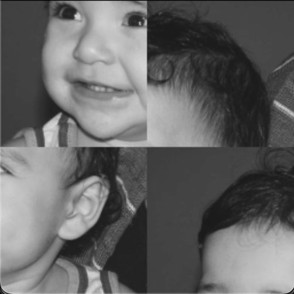
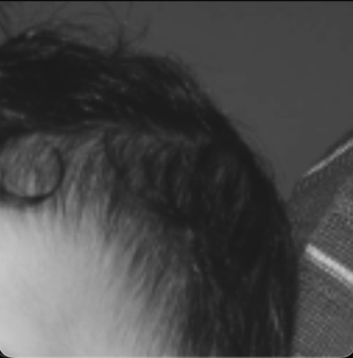

# Image Quadrants Manipulator 🖼️

A simple computer vision program designed to manipulate quadrants of an image. This program allows users to select quadrants from the original image and position where desired in the image.

## Run 🚀

```bash
make main && ./main
```

<small>

  _To use an image other than "biel.png", change line 5 corresponding to the IMAGE_FILE macro._

</small>

## Output 🖼️

| Original | Manipulated Quadrants |
|----------|-----------|
|||

|Left|Right|
|----------|-----------|
|||
|||

### Images Output 📸

```bash
🖼️  Quadrants - [biel.png] 🖼️

──────────────────────────────────────────────

📍 Which quadrant do you want to replace 1º (1-4)? 3
📍 Which quadrant do you want to replace 2º (1-4)? 2
📍 Which quadrant do you want to replace 3º (1-4)? 4
📍 Which quadrant do you want to replace 4º (1-4)? 1

💡 Do you want to show the quadrants individually (y/n)? y

✅ Quadrants successfully manipulated!

──────────────────────────────────────────────

🎓 Sudent: Ernane Ferreira - DCA0445
```