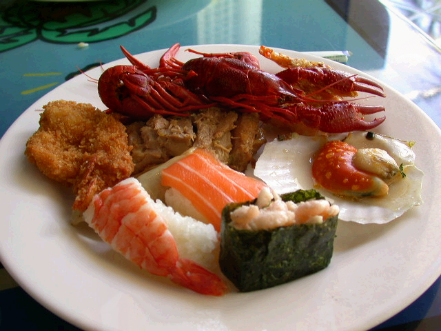
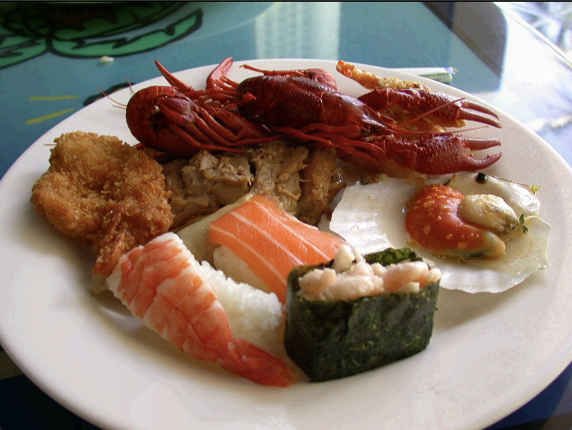
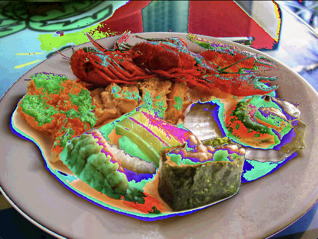
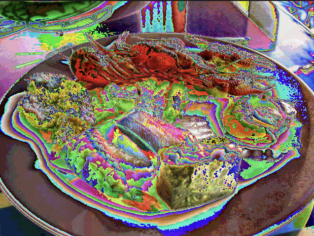
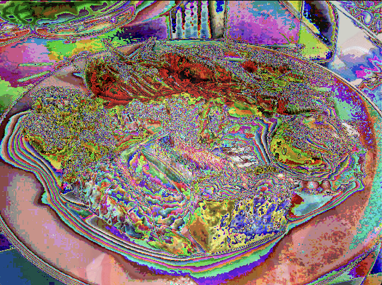
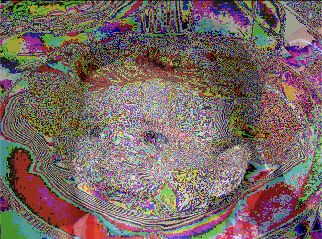
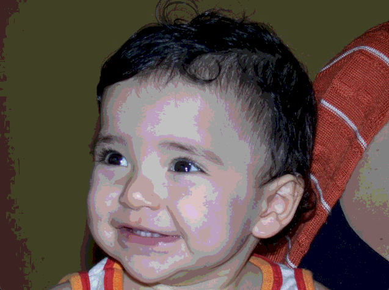
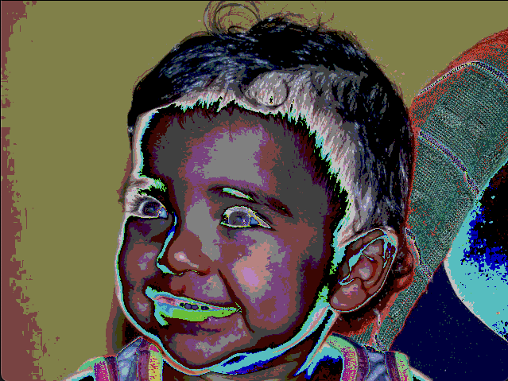
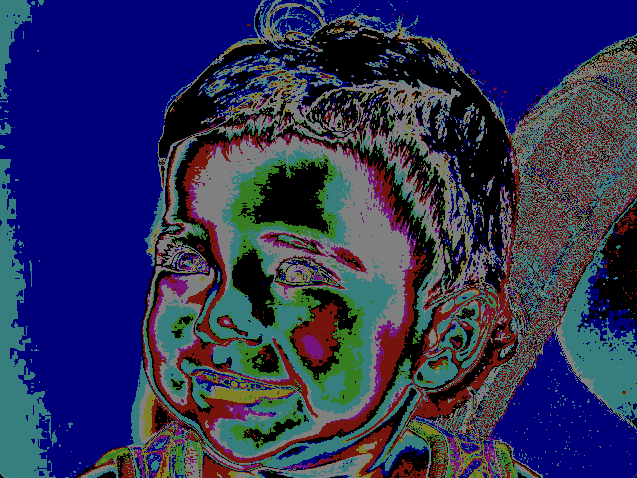
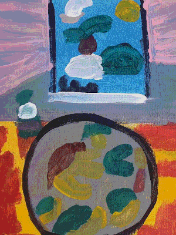

# Steganography

Steganography is the practice of concealing messages, images, or files within other non-secret text or data to avoid detection. This repository provides an implementation of steganography algorithms to encode and decode hidden information within images.

## Build and Run 🚀

```bash
make main && ./main
```

## Output 🖼️

### Images Output 📸

Below are the images used to develop the algorithm. The image on the left is the main image and the one on the right is the image that we will hide.

| Main image | Hidden image |
|:----------:|:------------:|
|||

After carrying out the process, we have the 'coded' image, that is, the image resulting from the mixture of the two above where the most significant bits represent the most significant bits of the 'sushi.jpg' image and the least significant bits represent the most significant bits of the image 'biel.jpg'.

| Encode     | Decode       |
|:----------:|:------------:|
|||

For a better visualization, we can show the bit Plans. The idea is to reset the most significant bits of the 'encoded' image and move the least significant bits to the left by 'n' positions, revealing the hidden image. The factor 'n' being the amount of bits removed from the main image.

| Plan 0     | Plan 1       | Plan 2       | Plan 3       |
|:----------:|:------------:|:------------:|:------------:|
| | | | |

| Plan 4     | Plan 5       | Plan 6       | Plan 7       |
|:----------:|:------------:|:------------:|:------------:|
| | | | |

As a challenge, we were given an image whose least significant bits already represented another image. The goal was to find out which one it was. Below is the given image (left) and the image we revealed by the algorithm (right) hidden in it.

| Challenge     | Image found       |
|:----------:|:------------:|
|||

### Terminal Output 🖥️

```bash
Welcome to the Menu! 🌟

1️⃣  → 🔐 Encode: Indicate the path of two images and obtain as output the second image hidden inside the first.
2️⃣  → 🔓 Decode: Indicate the path of an image and obtain as output the image hidden inside it.
3️⃣  → 🖼️  Bit Plan: Indicate the path of an image and obtain as output the image with the bit Plans separated.
4️⃣  → ❌ Exit: Close the program.

What would you like to do? 1

-------------------------------------------------------

🔐 Encode 🔐
 
👉 Enter the path of the carrier image: ./assets/sushi.jpg
👉 Enter the path of the hidden image: ./assets/biel.jpg

✅ Images loaded successfully!

🚀 Encoding.....

🎉 Image encoded successfully!

ℹ️  Image 2 (./assets/biel.jpg) was stored in the least significant bits of image 1 (./assets/sushi.jpg).
ℹ️  The result can be viewed in the output folder (./assets/output/encode-steganography.png).

-------------------------------------------------------

Welcome to the Menu! 🌟

1️⃣  → 🔐 Encode: Indicate the path of two images and obtain as output the second image hidden inside the first.
2️⃣  → 🔓 Decode: Indicate the path of an image and obtain as output the image hidden inside it.
3️⃣  → 🖼️  Bit Plan: Indicate the path of an image and obtain as output the image with the bit Plans separated.
4️⃣  → ❌ Exit: Close the program.

What would you like to do? 2

-------------------------------------------------------

🔓 Decode 🔓
 
👉 Enter the encoded image path: ./assets/output/encode-steganography.png

✅ Image loaded successfully!

🎉 Image decoded successfully!

ℹ️  Selected image (./assets/output/encode-steganography.png) has been decoded.
ℹ️  The result can be viewed in the output folder (./assets/output/decode-steganography.png).

-------------------------------------------------------

Welcome to the Menu! 🌟

1️⃣  → 🔐 Encode: Indicate the path of two images and obtain as output the second image hidden inside the first.
2️⃣  → 🔓 Decode: Indicate the path of an image and obtain as output the image hidden inside it.
3️⃣  → 🖼️  Bit Plan: Indicate the path of an image and obtain as output the image with the bit Plans separated.
4️⃣  → ❌ Exit: Close the program.

What would you like to do? 3

-------------------------------------------------------

🖼️ Bit Plan 🖼️
 
👉 Enter the path of the image: ./assets/output/encode-steganography.png

✅ Image loaded successfully!

🚀 Separating bit Plans.....

ℹ️  The image will be displayed in 8 windows, each one showing a different bit Plan.

🖼️ Showing plans.

ℹ️ Plan 0 displayed. Press any key to continue.
ℹ️ Plan 1 displayed. Press any key to continue.
ℹ️ Plan 2 displayed. Press any key to continue.
ℹ️ Plan 3 displayed. Press any key to continue.
ℹ️ Plan 4 displayed. Press any key to continue.
ℹ️ Plan 5 displayed. Press any key to continue.
ℹ️ Plan 6 displayed. Press any key to continue.
ℹ️ Plan 7 displayed. Press any key to continue.

ℹ️ Finished displaying Plans.

🎉 Bit Plans separated successfully!

-------------------------------------------------------

Welcome to the Menu! 🌟

1️⃣  → 🔐 Encode: Indicate the path of two images and obtain as output the second image hidden inside the first.
2️⃣  → 🔓 Decode: Indicate the path of an image and obtain as output the image hidden inside it.
3️⃣  → 🖼️  Bit Plan: Indicate the path of an image and obtain as output the image with the bit Plans separated.
4️⃣  → ❌ Exit: Close the program.

What would you like to do? 4

Goodbye! 👋
```